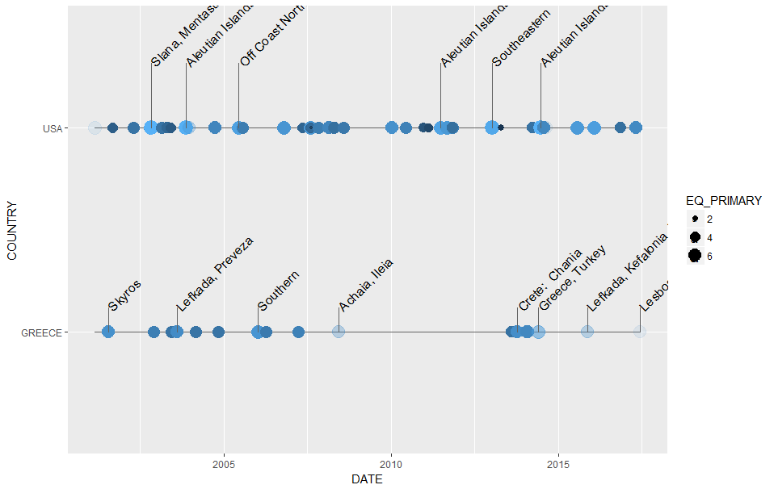
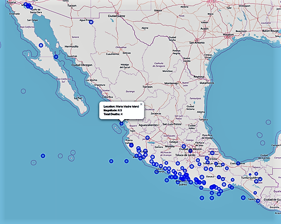

# quaker
R package to display &amp; map earthquake data

The quaker package can assist in access to the U.S. National Oceanographic and Atmospheric Administration (NOAA) on significant earthquakes around the world. 

The quaker function **eq_clean_data** prepares NOAA website data for visualization and analysis

ggplot2 extentions **geom_timeline** and **geom_timeline_label** allow views of earthquake data over time for one or more countries

interactive leaflet maps **eq_map** displays earthquake locations on an interactive map providing additional information as the user selects data points

Unit testing for the new geoms uses the vdiffr library to compare plot output.

To install the quaker package:

	install.packages("devtools")
	devtools::install_github("jrwalker-projects/quaker")